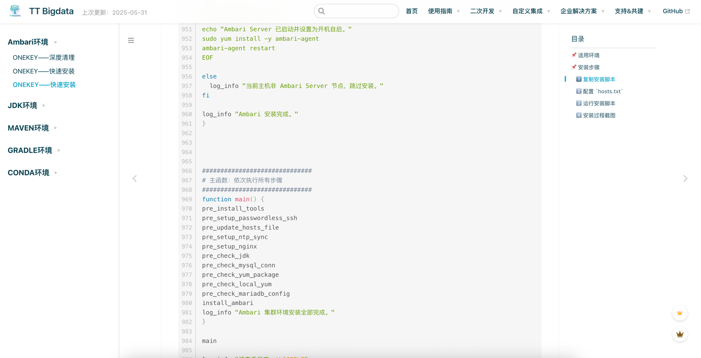
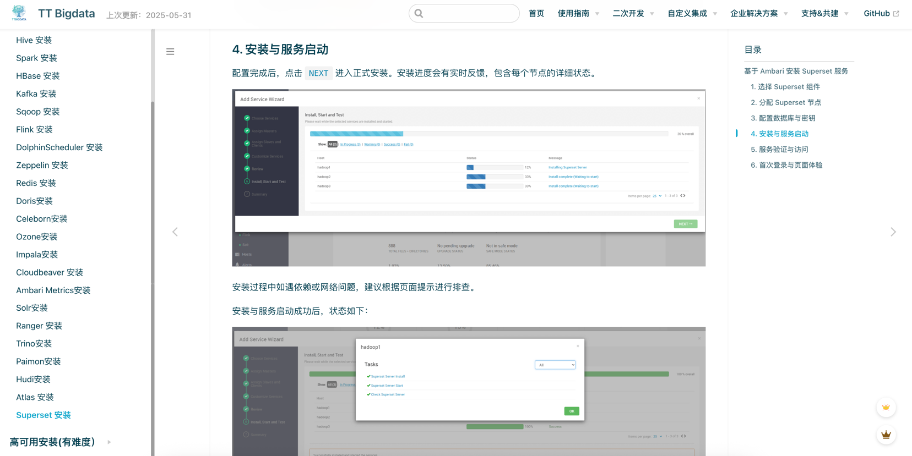
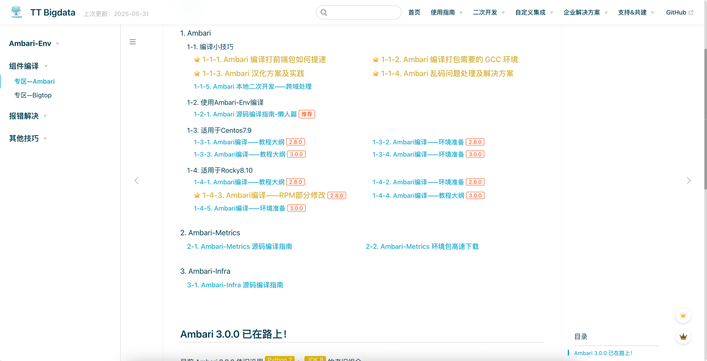

# Ambari+Bigtop 一站式编译和部署解决方案 🚀✨

  
  
   
  
  
  

---

## 🚨 写在前面 · Ambari3.0.0我们已经满血适配！👀

- 提供el7（如Centos7)，el8(如Rocky8) 镜像
  
- Ubuntu 和 国产化 正在路上
  
- 你敢说不全？
  
- 你敢说不能一键部署？900多行代码？
  
- 你敢说你不会安装？
  
- 你敢说自己想编译了？
  

不！你不敢。你要的我都有。
---

## 📚 项目简介

> 建议优先访问（更新更快 + 源头首发）  
> 🧭 **[官方文档站](https://doc.janettr.com)**  
> 🚀 [Gitee 镜像站（同步更新）](https://gitee.com/tt-bigdata/ambari-env)

本项目基于以下版本进行魔改与增强，提供一站式编译、部署、管理解决方案：

- **Ambari 2.8.0 & Ambari 3.0.0**
- **Bigtop 3.2.0**

提供 **开箱即用** 的大数据组件部署方案，简化运维，支持多种主流组件，致力于打造稳定、可靠、高效的大数据生态环境。

---

## 🚀 版本说明

|   **版本**   |     **组件名称**     |    **组件版本**    | **env 版本** | **环境适配**  |
|:----------:|:----------------:|:--------------:|:----------:|:---------:|
| **v2.0.0** |      Ambari      |     3.0.0      |   2.0.0    | el7 & el8 |
|            |      下面所有组件      |  1.0.0-1.0.7   |   2.0.0    | el7 & el8 |
| **v1.0.7** |     Superset     |     4.1.2      |   1.0.7    |   仅 el7   |
|            |      Atlas       |     2.4.0      |   1.0.7    |   仅 el7   |
|            |      Spark       |  3.5.5（版本升级）   |   1.0.7    |   仅 el7   |
|            |      Flink       |  1.17.2（版本升级）  |   1.0.7    |   仅 el7   |
| **v1.0.6** |      Trino       |      474       |   1.0.6    |   仅 el7   |
|            |       Hudi       |     1.1.0      |   1.0.6    |   仅 el7   |
|            |      Paimon      |     1.0.1      |   1.0.6    |   仅 el7   |
| **v1.0.5** |      Ozone       |     1.4.1      |   1.0.5    |   仅 el7   |
|            |      Impala      |     4.4.1      |   1.0.5    |   仅 el7   |
|            |   Nightingale    |     7.7.2      |   1.0.5    |   仅 el7   |
|            |     Categraf     |     0.4.1      |   1.0.5    |   仅 el7   |
|            | VictoriaMetrics  |    1.109.1     |   1.0.5    |   仅 el7   |
|            |   Cloudbeaver    |     24.3.3     |   1.0.5    |   仅 el7   |
|            |     Celeborn     |     0.5.3      |   1.0.5    |   仅 el7   |
| **v1.0.4** |      Doris       |     2.1.7      |   1.0.4    |   仅 el7   |
| **v1.0.3** |     Phoenix      |     5.1.2      |   1.0.3    |   仅 el7   |
|            | Dolphinscheduler |     3.2.2      |   1.0.3    |   仅 el7   |
| **v1.0.2** |      Redis       |     7.4.0      |   1.0.2    |   仅 el7   |
| **v1.0.1** |      Sqoop       |     1.4.7      |   1.0.1    |   仅 el7   |
|            |      Ranger      |     2.4.0      |   1.0.1    |   仅 el7   |
| **v1.0.0** |    Zookeeper     |     3.5.9      |   1.0.0    |   仅 el7   |
|            |      Hadoop      |     3.3.4      |   1.0.0    |   仅 el7   |
|            |    ~~Flink~~     |   ~~1.15.3~~   |   1.0.0    |   仅 el7   |
|            |      HBase       |     2.4.13     |   1.0.0    |   仅 el7   |
|            |       Hive       |     3.1.3      |   1.0.0    |   仅 el7   |
|            |      Kafka       |     2.8.1      |   1.0.0    |   仅 el7   |
|            |    ~~Spark~~     |   ~~3.2.3~~    |   1.0.0    |   仅 el7   |
|            |       Solr       |     8.11.2     |   1.0.0    |   仅 el7   |
|            |       Tez        |     0.10.1     |   1.0.0    |   仅 el7   |
|            |     Zeppelin     |     0.10.1     |   1.0.0    |   仅 el7   |
|            |       Livy       |     0.7.1      |   1.0.0    |   仅 el7   |
|            |    ~~Ambari~~    | ~~branch-2.8~~ |   1.0.0    |   仅 el7   |
|            |  Ambari Metrics  |   branch-3.0   |   1.0.0    |   仅 el7   |
|            |   Ambari Infra   |     master     |   1.0.0    |   仅 el7   |

---

## 🔧 快速上手

[参考文档](https://doc.janettr.com)

教你如何安装，如何卸载，并提供了一键安装脚本

## 效果图

---

## ❤️ 支持本项目

如果你觉得本项目对你有帮助，可以通过以下方式支持：

1. ⭐ **Star** 本项目，帮助它被更多人看到 🚀
2. 📢 **分享** 本项目，帮助更多开发者受益
3. 🍵 **打赏**，请作者喝一杯茶 ☕（见下方二维码）

|                    微信赞赏                    |                          微信号                           |                        QQ 群                        |                
|:------------------------------------------:|:------------------------------------------------------:|:--------------------------------------------------:|
|  |  |  |

---

## 📜 许可证

本项目采用 [Apache 2.0](LICENSE) 许可证。

---
