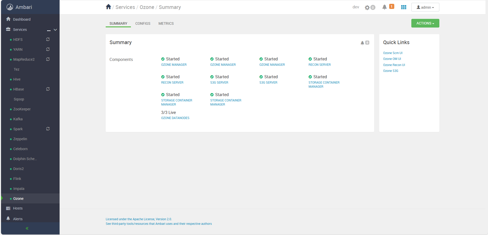
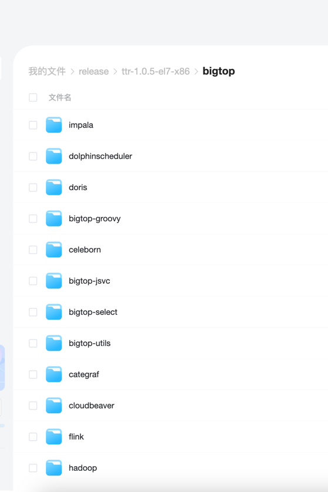

# Ambari+Bigtop 一站式编译和部署解决方案 🚀✨

  
  
   
  
  

---

## 🚨 写在前面 · 看清楚再喊 3.0！👀

问得最多的问题是：**“啥时候上 3.0？”** 🤔

兄弟，真不是我不想上——
眼前这套你都还没捣明白，就天天念叨 3.0？🫠

📚 **睁眼闭眼全是 3.0，[知识库](https://doc.janettr.com)你一页都没翻，是不是有点不讲武德了？**

💥 **别催，3.0很快就到！** 到时候一定第一时间群里同步，\*\*满！血！移！植！\*\*💯

✨ 点个 ⭐Star，3.0体验安排得明明白白，优先享受最新版本！🚀

🧠 **先别急，刀磨快了才好砍柴，先把现在这套练熟吧。**

> 🔥 **新鲜出炉：Spark、Flink 也全面升级，还引入了 Atlas！**
> 📢 **湖仓 Hudi + Paimon 现在已经支持，社区用户快上车！**

---

## 📚 项目简介

> 建议优先访问（更新更快 + 源头首发）  
> 🧭 **[官方文档站](https://doc.janettr.com)**  
> 🚀 [Gitee 镜像站（同步更新）](https://gitee.com/tt-bigdata/ambari-env)

本项目基于以下版本进行魔改与增强，提供一站式编译、部署、管理解决方案：

- **Ambari 2.8.0**
- **Bigtop 3.2.0**

提供 **开箱即用** 的大数据组件部署方案，简化运维，支持多种主流组件，致力于打造稳定、可靠、高效的大数据生态环境。

---

## 🚀 版本说明

|     **版本**      |     **组件名称**     |   **组件版本**   | **env 版本** | 
|:---------------:|:----------------:|:------------:|:----------:|
| **v1.0.7-即将上线** |      Atlas       |    2.4.0     |   1.0.7    | 
|                 |      Spark       |  3.5.5（版本升级  |   1.0.7    | 
|                 |      Flink       | 1.17.2（版本升级） |   1.0.7    | 
|   **v1.0.6**    |      Trino       |     474      |   1.0.6    | 
|                 |       Hudi       |    1.1.0     |   1.0.6    | 
|                 |      Paimon      |    1.0.1     |   1.0.6    | 
|   **v1.0.5**    |      Ozone       |    1.4.1     |   1.0.5    | 
|                 |      Impala      |    4.4.1     |   1.0.5    | 
|                 |   Nightingale    |    7.7.2     |   1.0.5    | 
|                 |     Categraf     |    0.4.1     |   1.0.5    | 
|                 | VictoriaMetrics  |   1.109.1    |   1.0.5    | 
|                 |   Cloudbeaver    |    24.3.3    |   1.0.5    | 
|                 |     Celeborn     |    0.5.3     |   1.0.5    | 
|   **v1.0.4**    |      Doris       |    2.1.7     |   1.0.4    | 
|   **v1.0.3**    |     Phoenix      |    5.1.2     |   1.0.3    | 
|                 | Dolphinscheduler |    3.2.2     |   1.0.3    | 
|   **v1.0.2**    |      Redis       |    7.4.0     |   1.0.2    | 
|   **v1.0.1**    |      Sqoop       |    1.4.7     |   1.0.1    | 
|                 |      Ranger      |    2.4.0     |   1.0.1    | 
|   **v1.0.0**    |    Zookeeper     |    3.5.9     |   1.0.0    | 
|                 |      Hadoop      |    3.3.4     |   1.0.0    | 
|                 |    ~~Flink~~     |  ~~1.15.3~~  |   1.0.0    | 
|                 |      HBase       |    2.4.13    |   1.0.0    | 
|                 |       Hive       |    3.1.3     |   1.0.0    | 
|                 |      Kafka       |    2.8.1     |   1.0.0    | 
|                 |    ~~Spark~~     |  ~~3.2.3~~   |   1.0.0    | 
|                 |       Solr       |    8.11.2    |   1.0.0    | 
|                 |       Tez        |    0.10.1    |   1.0.0    | 
|                 |     Zeppelin     |    0.10.1    |   1.0.0    | 
|                 |       Livy       |    0.7.1     |   1.0.0    | 
|                 |      Ambari      |  branch-2.8  |   1.0.0    | 
|                 |  Ambari Metrics  |  branch-3.0  |   1.0.0    | 
|                 |   Ambari Infra   |    master    |   1.0.0    | 

---

## 🔧 快速上手

[参考文档](https://doc.janettr.com)

教你如何安装，如何卸载，并提供了一键安装脚本

## 效果图

---

## ❤️ 支持本项目

如果你觉得本项目对你有帮助，可以通过以下方式支持：

1. ⭐ **Star** 本项目，帮助它被更多人看到 🚀
2. 📢 **分享** 本项目，帮助更多开发者受益
3. 🍵 **打赏**，请作者喝一杯茶 ☕（见下方二维码）

|                    微信赞赏                    |                          微信号                           |                        QQ 群                        |                
|:------------------------------------------:|:------------------------------------------------------:|:--------------------------------------------------:|
|  |  |  |

---

## 📜 许可证

本项目采用 [Apache 2.0](LICENSE) 许可证。

---
